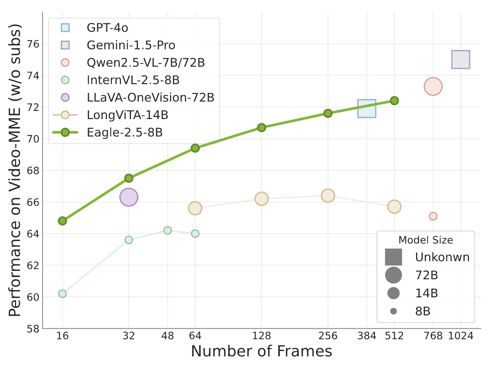

<div align="center">

# Eagle Family:  Exploring Model Designs, Data Recipes and Training Strategies for Frontier-Class Multimodal LLMs

</div>

[](https://github.com/tatsu-lab/stanford_alpaca/blob/main/LICENSE)
[](MODEL_LICENSE)


[[📜 Eagle2.5 Paper](https://arxiv.org/abs/2504.15271)] [[📜 Eagle2 Paper](http://arxiv.org/abs/2501.14818)] [[📜 Eagle1 Paper](https://arxiv.org/pdf/2408.15998)] [[🤗 HF Models](https://huggingface.co/collections/nvidia/eagle-2-6764ba887fa1ef387f7df067)] [[🤗 HF Demo](https://huggingface.co/spaces/nvidia/Eagle2-Demo)] [[Faster Demo](https://4760e7b4534dd26c3e.gradio.live)] [[Project Page](https://nvlabs.github.io/EAGLE/)]


## Introduction

Eagle 2.5 is a family of frontier vision-language models (VLMs) designed for long-context multimodal learning. While most existing VLMs focus on short-context tasks, Eagle 2.5 addresses the challenges of long video comprehension and high-resolution image understanding, providing a generalist framework for both. The Eagle 2.5 training framework introduces two key techniques—Automatic Degrade Sampling (ADS) and Image Area Preservation (IAP)—to preserve contextual integrity and visual details. Additionally, the training pipeline is optimized for efficient long-context data training.

A major contribution of Eagle 2.5 is the introduction of Eagle-Video-110K, a novel dataset with both story-level and clip-level annotations, specifically curated for long video understanding. Eagle 2.5 demonstrates substantial improvements on long-context multimodal benchmarks, offering a robust solution to the limitations of existing VLMs. Notably, Eagle 2.5-8B achieves 72.4% on Video-MME with 512 input frames, matching the results of top-tier commercial models such as GPT-4o and large-scale open-source models like Qwen2.5-VL-72B and InternVL2.5-78B, despite having significantly fewer parameters.

### Key Innovations

- **Information-First Sampling**: 
  - *Image Area Preservation (IAP)*: Optimizes image tiling to retain most of the original image area and aspect ratio, preserving fine-grained details.
  - *Automatic Degrade Sampling (ADS)*: Dynamically balances visual and textual input, ensuring complete text retention while maximizing visual content within context length constraints.
- **Progressive Mixed Post-Training**: 
  - Gradually increases context length during training, enhancing the model's ability to process varying input sizes and improving information density over static sampling.
- **Diversity-Driven Data Recipe**: 
  - Combines open-source data (human-annotated and synthetic) with the self-curated Eagle-Video-110K dataset, collected via a diversity-driven strategy and annotated with both story-level and clip-level QA pairs.


 <div align="center">
 
 </div>
 


## Updates
- [2025/04] 🔥 Release Eagle-2.5!
- [2025/01] 🔥 Release Eagle-2!
- [2025/01] 🔥 [Eagle-1](./Eagle1/README.md) is accepted by [ICLR 2025](https://iclr.cc).
- [2024/08] Release [Eagle-1](./Eagle1/README.md).


## Model Zoo
We provide the following models:

| model name         | LLM  | Vision  | Max Length| HF Link|
| ----------- | ------- |---------|-|-|
| Eagle2-1B | [Qwen2.5-0.5B-Instruct](https://huggingface.co/Qwen/Qwen2.5-0.5B-Instruct) |  Siglip    | 16K| [🤗 link](https://huggingface.co/nvidia/Eagle2-1B)|
| Eagle2-2B | [Qwen2.5-1.5B-Instruct](https://huggingface.co/Qwen/Qwen2.5-1.5B-Instruct) |  Siglip    | 16K| [🤗 link](https://huggingface.co/nvidia/Eagle2-2B)|
| Eagle2-9B | [Qwen2.5-7B-Instruct](https://huggingface.co/Qwen/Qwen2.5-7B-Instruct) |  Siglip+ConvNext    | 16K| [🤗 link](https://huggingface.co/nvidia/Eagle2-9B)|

## Benchmark Results


### Eagle2.5 Video Benchmarks

| Benchmark                                 | GPT-4o             | Gemini-1.5 Pro    | InternVL2.5-8B      | Qwen2.5-VL-8B       | **Eagle2.5-8B**     |
|--------------------------------------------|--------------------|-------------------|---------------------|---------------------|---------------------|
| MVBench<sub>test</sub>                     | -                  | -                 | 72.0                | 69.6                | **74.8**            |
| Perception_test<sub>val</sub>              | -                  | -                 | -                   | 70.5                | **82.0**            |
| EgoSchema<sub>fullset</sub>                | -                  | 72.2              | -                   | 65.0                | **72.2**            |
| MMB-Video                                 | 1.63               | 1.30              | 1.68                | 1.79                | **1.94**            |
| MLVU<sub>val</sub>                         | -                  | -                 | 68.9                | 70.2                | **77.6**            |
| LVBench<sub>val</sub>                      | 66.7               | 64.0              | 60.0                | 56.0                | **66.4**            |
| Video-MME<sub>w/o subtitle</sub>           | 71.9               | 75.0              | 64.2                | 65.1                | **72.4**            |
| Video-MME<sub>w subtitle</sub>             | 77.2               | 81.3              | 66.9                | 71.6                | **75.7**            |
| CG-Bench<sub>Clue</sub>                    | 58.6               | 50.9              | -                   | 44.5                | **55.8**            |
| CG-Bench<sub>Long</sub>                    | 44.9               | 37.8              | -                   | 35.5                | **46.6**            |
| CG-Bench<sub>mIoU</sub>                    | 5.73               | 3.85              | -                   | 2.48                | **13.4**            |
| HourVideo<sub>Dev</sub>                    | -                  | 37.2              | -                   | -                   | **44.5**            |
| HourVideo<sub>Test</sub>                   | -                  | 37.4              | -                   | -                   | **41.8**            |
| Charade-STA<sub>mIoU</sub>                 | 35.7               | -                 | -                   | 43.6                | **65.9**            |
| HD-EPIC                                   | -                  | 37.6                 | -                   | -                   | **42.9**            |
| HRVideoBench                              | -                  | -                 | -                   | -                   | **68.5**            |
| EgoPlan<sub>val</sub>                      | -                  | -                 | -                   | -                   | **45.3**            |

### Eagle2.5 Embodied Benchmarks
| Benchmark                                 | GPT-4o             | Gemini-1.5 Pro    | InternVL2.5-8B      | Qwen2.5-VL-8B       | **Eagle2.5-8B**     |
|--------------------------------------------|--------------------|-------------------|---------------------|---------------------|---------------------|
| OpenEQA                                    | -                  | -                 | -                   | -                   | **63.5**            |
| ERQA                                       | 47.0                  | 41.8                 | -                   | -                   | **38.3**            |
| EgoPlan<sub>val</sub>                      | -                  | -                 | -                   | -                   | **45.3**            |


### Eagle2.5 Image Benchmarks

| Benchmark                                 | GPT-4o             | Gemini-1.5 Pro    | InternVL2.5-8B      | Qwen2.5-VL-8B       | **Eagle2.5-8B**     |
|--------------------------------------------|--------------------|-------------------|---------------------|---------------------|---------------------|
| DocVQA<sub>test</sub>                      | 92.8               | 93.1              | 93.0                | 95.7                | **94.1**            |
| ChartQA<sub>test</sub>                     | 85.7               | 87.2              | 84.8                | 87.3                | **87.5**            |
| InfoVQA<sub>test</sub>                     | 79.2               | 81.0              | 77.6                | 82.6                | **80.4**            |
| TextVQA<sub>val</sub>                      | 77.4               | 78.8              | 79.1                | 84.9                | **83.7**            |
| OCRBench<sub>test</sub>                    | 736                | 754               | 822                 | 864                 | **869**             |
| MMstar<sub>test</sub>                      | 64.7               | 59.1              | 62.8                | 63.9                | **66.2**            |
| RWQA<sub>test</sub>                        | 75.4               | 67.5              | 70.1                | 68.5                | **76.7**            |
| AI2D<sub>test</sub>                        | 84.6               | 79.1              | 84.5                | 83.9                | **84.5**            |
| MMMU<sub>val</sub>                         | 69.1               | 62.2              | 56.0                | 58.6                | **55.8**            |
| MMBench_V11<sub>test</sub>                 | 83.1               | 74.6              | 83.2                | 82.6                | **81.7**            |
| MMVet<sub>GPT-4-Turbo</sub>                | 69.1               | 64.0              | 62.8                | 67.1                | **62.9**            |
| HallBench<sub>avg</sub>                    | 55.0               | 45.6              | 50.1                | 52.9                | **54.7**            |
| MathVista<sub>testmini</sub>               | 63.8               | 63.9              | 64.4                | 68.2                | **67.8**            |
| Avg Score                                 | 74.9               | 71.7              | 73.1                | 75.6                | **75.6**            |


*All numbers are directly extracted from Table 2 and Table 3 of the Eagle 2.5 Tech Report.*

<details>
  <summary>Eagle2-1B Results</summary>

|          Benchmark           | LLaVa-One-Vision-0.5B | InternVL2-1B | InternVL2.5-1B |Qwen2-VL-2B| Eagle2-1B|
| :--------------------------: | :------------------: | :----------------: | :----------: |:----------: |:----------: |  
|    DocVQA<sub>test</sub>     |         70.0         |        81.7        |     84.8     |90.1|81.8|
|    ChartQA<sub>test</sub>    |          61.4         |        72.9        |     75.9     |73.0|77.0|
|    InfoVQA<sub>test</sub>    |          41.8           |        50.9        |     56.0     |65.5|54.8|
|    TextVQA<sub>val</sub>     |         -         |        70.0       |     72.0     |79.7|76.6|
|           OCRBench           |         565          |        754         |     785      |809|767|
|      MME<sub>sum</sub>       |        1438.0     |       1794.4      |    1950.5   |  1872.0| 1790.2|
|         RealWorldQA          |        55.6     |        50.3       |    57.5     |62.6|55.4|
|     AI2D<sub>test</sub>      |         57.1         |        64.1        |     69.3    | 74.7 |70.9|
|      MMMU<sub>val</sub>      |          31.4       |    36.7     | 40.9  |41.1|38.8|
| MMVet<sub>GPT-4-Turbo</sub>  |         32.2       |        32.7       |    48.8    | 49.5|40.9|             HallBench<sub>avg</sub>    |         27.9      |        34.0       |     39.0     |**41.7**|35.3
| MathVista<sub>testmini</sub> |         33.8         |        37.7        |     43.2     |43.0|45.3|
| MMstar |             37.7    |       45.7      |     50.1|48.0|48.5|
</details>

<details>
<summary>Eagle2-2B Results</summary>

|          Benchmark           | InternVL2-2B | InternVL2.5-2B | InternVL2-4B |Qwen2-VL-2B| Eagle2-2B|
| :--------------------------: | :------------------: | :----------------: | :----------: |:----------: |:----------: |  
|    DocVQA<sub>test</sub>     |         86.9 |        88.7  |     89.2    |90.1|88.0|
|    ChartQA<sub>test</sub>    |          76.2        |        79.2        |     81.5     |73.0|82.0|
|    InfoVQA<sub>test</sub>    |         58.9   |        60.9     |    67.0     |65.5|65.8|
|    TextVQA<sub>val</sub>     |         73.4         |        74.3       |     74.4   |79.7|79.1|
|           OCRBench           |         784          |        804         |     788      |809|818|
|      MME<sub>sum</sub>       |   1876.8         |    2138.2    |    2059.8   |1872.0  | 2109.8
|         RealWorldQA          |        57.3     |        60.1      |    60.7     |62.6|63.1|
|     AI2D<sub>test</sub>      |        74.1   |        74.9     |     74.7    | 78.9 |79.3|
|      MMMU<sub>val</sub>      |          36.3       |    43.6     | 47.9  |41.1|43.1|
| MMVet<sub>GPT-4-Turbo</sub>  |         39.5       |       60.8       |     51.0     | 49.5|53.8|
|   HallBench<sub>avg</sub>    |         37.9      |        42.6      |     41.9     |41.7|45.8
| MathVista<sub>testmini</sub> |         46.3      |        51.3       |     58.6     |43.0|54.7|
| MMstar |            50.1    |       53.7     |     54.3|48.0|56.4|
</details>

<details>
<summary>Eagle2-9B Results</summary>
|          Benchmark           | MiniCPM-Llama3-V-2_5 | InternVL-Chat-V1-5 | InternVL2-8B |QwenVL2-7B| Eagle2-9B|
| :--------------------------: | :------------------: | :----------------: | :----------: |:----------: |:----------: |
|          Model Size          |         8.5B         |       25.5B        |     8.1B     | 8.3B|8.9B|
|                              |                      |                    |              | | |
|    DocVQA<sub>test</sub>     |         84.8         |        90.9        |     91.6     |**94.5**|92.6|
|    ChartQA<sub>test</sub>    |          -           |        83.8        |     83.3     |83.0|**86.4**|
|    InfoVQA<sub>test</sub>    |          -           |        72.5        |     74.8     |74.3|**77.2**|
|    TextVQA<sub>val</sub>     |         76.6         |        80.6        |     77.4     |**84.3**|83.0|
|           OCRBench           |         725          |        724         |     794      |845|**868**|
|      MME<sub>sum</sub>       |        2024.6        |       2187.8       |    2210.3    |  **2326.8**|2260|
|         RealWorldQA          |         63.5         |        66.0        |     64.4     |**70.1**|69.3|
|     AI2D<sub>test</sub>      |         78.4         |        80.7        |     83.8     | - |**83.9**|
|      MMMU<sub>val</sub>      |         45.8         |    45.2 / 46.8     | 49.3 / 51.8  |54.1|**56.1**|
|  MMBench_V11<sub>test</sub>   |               |            |     79.5     |79.4|**80.6**|
| MMVet<sub>GPT-4-Turbo</sub>  |         52.8         |        55.4        |     54.2     | 62.0|**62.2**|
|          SEED-Image          |         72.3         |        76.0        |     76.2     ||**77.1**|
|   HallBench<sub>avg</sub>    |         42.4         |        49.3        |     45.2     |**50.6**|49.3
| MathVista<sub>testmini</sub> |         54.3         |        53.5        |     58.3     |58.2|**63.8**|
| MMstar |             -    |       -      |      60.9|60.7|**62.6**|

</details>

## Stremlit Demo

We provide a [local chat demo](./Eagle2/streamlit_demo/README.md) powered by `Streamlit` to help users get started with `Eagle2` quickly and easily.
This demo is built upon [InternVL's template](https://internvl.readthedocs.io/en/latest/get_started/local_chat_demo.html) and extends it with additional video input support for enhanced functionality.

## Inference

We provide a [inference script](./Eagle2/inference/README.md) to help you quickly start using the model. We support different input types: 
- pure text input
- single image input
- multiple image input
- video input

### 0. Install the dependencies

```bash
pip install transformers==4.37.2
pip install flash-attn
```
**Note**: Latest version of transformers is not compatible with the model.

### 1. Prepare the Model worker

<details>
  <summary>Click to expand</summary>

```python

"""
A model worker executes the model.
Copied and modified from https://github.com/OpenGVLab/InternVL/blob/main/streamlit_demo/model_worker.py
"""
# Importing torch before transformers can cause `segmentation fault`
from transformers import AutoModel, AutoTokenizer, TextIteratorStreamer, AutoConfig

import argparse
import base64
import json
import os
import decord
import threading
import time
from io import BytesIO
from threading import Thread
import math
import requests
import torch
import torchvision.transforms as T
from PIL import Image
from torchvision.transforms.functional import InterpolationMode
import numpy as np


IMAGENET_MEAN = (0.485, 0.456, 0.406)
IMAGENET_STD = (0.229, 0.224, 0.225)

SIGLIP_MEAN = (0.5, 0.5, 0.5)
SIGLIP_STD = (0.5, 0.5, 0.5)


def get_seq_frames(total_num_frames, desired_num_frames=-1, stride=-1):
    """
    Calculate the indices of frames to extract from a video.

    Parameters:
    total_num_frames (int): Total number of frames in the video.
    desired_num_frames (int): Desired number of frames to extract.

    Returns:
    list: List of indices of frames to extract.
    """
    
    assert desired_num_frames > 0 or stride > 0 and not (desired_num_frames > 0 and stride > 0)

    if stride > 0:
        return list(range(0, total_num_frames, stride))
    
    # Calculate the size of each segment from which a frame will be extracted
    seg_size = float(total_num_frames - 1) / desired_num_frames

    seq = []
    for i in range(desired_num_frames):
        # Calculate the start and end indices of each segment
        start = int(np.round(seg_size * i))
        end = int(np.round(seg_size * (i + 1)))

        # Append the middle index of the segment to the list
        seq.append((start + end) // 2)

    return seq

def build_video_prompt(meta_list, num_frames, time_position=False):
    # if time_position is True, the frame_timestamp is used.
    # 1. pass time_position, 2. use env TIME_POSITION
    time_position = os.environ.get("TIME_POSITION", time_position)
    prefix = f"This is a video:\n"
    for i in range(num_frames):
        if time_position:
            frame_txt = f"Frame {i+1} sampled at {meta_list[i]:.2f} seconds: <image>\n"
        else:
            frame_txt = f"Frame {i+1}: <image>\n"
        prefix += frame_txt
    return prefix

def load_video(video_path, num_frames=64, frame_cache_root=None):
    if isinstance(video_path, str):
        video = decord.VideoReader(video_path)
    elif isinstance(video_path, dict):
        assert False, 'we not support vidoe: "video_path" as input'
    fps = video.get_avg_fps()
    sampled_frames = get_seq_frames(len(video), num_frames)
    samepld_timestamps = [i / fps for i in sampled_frames]
    frames = video.get_batch(sampled_frames).asnumpy()
    images = [Image.fromarray(frame) for frame in frames]
    
    return images, build_video_prompt(samepld_timestamps, len(images), time_position=True)

def load_image(image):
    if isinstance(image, str) and os.path.exists(image):
        return Image.open(image)
    elif isinstance(image, dict):
        if 'disk_path' in image:
            return Image.open(image['disk_path'])
        elif 'base64' in image:
            return Image.open(BytesIO(base64.b64decode(image['base64'])))
        elif 'url' in image:
            response = requests.get(image['url'])
            return Image.open(BytesIO(response.content))
        elif 'bytes' in image:
            return Image.open(BytesIO(image['bytes']))
        else:
            raise ValueError(f'Invalid image: {image}')
    else:
        raise ValueError(f'Invalid image: {image}')

def build_transform(input_size, norm_type='imagenet'):
    if norm_type == 'imagenet':
        MEAN, STD = IMAGENET_MEAN, IMAGENET_STD
    elif norm_type == 'siglip':
        MEAN, STD = SIGLIP_MEAN, SIGLIP_STD
        
    transform = T.Compose([
        T.Lambda(lambda img: img.convert('RGB') if img.mode != 'RGB' else img),
        T.Resize((input_size, input_size), interpolation=InterpolationMode.BICUBIC),
        T.ToTensor(),
        T.Normalize(mean=MEAN, std=STD)
    ])
    return transform


def find_closest_aspect_ratio(aspect_ratio, target_ratios, width, height, image_size):
    """
    previous version mainly foucs on ratio.
    We also consider area ratio here.
    """
    best_factor = float('-inf')
    best_ratio = (1, 1)
    area = width * height
    for ratio in target_ratios:
        target_aspect_ratio = ratio[0] / ratio[1]
        ratio_diff = abs(aspect_ratio - target_aspect_ratio)
        area_ratio = (ratio[0]*ratio[1]*image_size*image_size)/ area
        """
        new area > 60% of original image area is enough.
        """
        factor_based_on_area_n_ratio = min((ratio[0]*ratio[1]*image_size*image_size)/ area, 0.6)* \
                                     min(target_aspect_ratio/aspect_ratio, aspect_ratio/target_aspect_ratio)
        
        if factor_based_on_area_n_ratio > best_factor:
            best_factor = factor_based_on_area_n_ratio
            best_ratio = ratio
        
    return best_ratio


def dynamic_preprocess(image, min_num=1, max_num=6, image_size=448, use_thumbnail=False):
    orig_width, orig_height = image.size
    aspect_ratio = orig_width / orig_height

    # calculate the existing image aspect ratio
    target_ratios = set(
        (i, j) for n in range(min_num, max_num + 1) for i in range(1, n + 1) for j in range(1, n + 1) if
        i * j <= max_num and i * j >= min_num)
    target_ratios = sorted(target_ratios, key=lambda x: x[0] * x[1])

    # find the closest aspect ratio to the target
    target_aspect_ratio = find_closest_aspect_ratio(
        aspect_ratio, target_ratios, orig_width, orig_height, image_size)

    # calculate the target width and height
    target_width = image_size * target_aspect_ratio[0]
    target_height = image_size * target_aspect_ratio[1]
    blocks = target_aspect_ratio[0] * target_aspect_ratio[1]

    # resize the image
    resized_img = image.resize((target_width, target_height))
    processed_images = []
    for i in range(blocks):
        box = (
            (i % (target_width // image_size)) * image_size,
            (i // (target_width // image_size)) * image_size,
            ((i % (target_width // image_size)) + 1) * image_size,
            ((i // (target_width // image_size)) + 1) * image_size
        )
        # split the image
        split_img = resized_img.crop(box)
        processed_images.append(split_img)
    assert len(processed_images) == blocks
    if use_thumbnail and len(processed_images) != 1:
        thumbnail_img = image.resize((image_size, image_size))
        processed_images.append(thumbnail_img)
    return processed_images

def split_model(model_path, device):

    device_map = {}
    world_size = torch.cuda.device_count()
    config = AutoConfig.from_pretrained(model_path, trust_remote_code=True)
    num_layers = config.llm_config.num_hidden_layers

    print('world_size', world_size)
    num_layers_per_gpu_ = math.floor(num_layers / (world_size - 1))
    num_layers_per_gpu = [num_layers_per_gpu_] * world_size
    num_layers_per_gpu[device] = num_layers - num_layers_per_gpu_ * (world_size-1)
    print(num_layers_per_gpu)
    layer_cnt = 0
    for i, num_layer in enumerate(num_layers_per_gpu):
        for j in range(num_layer):
            device_map[f'language_model.model.layers.{layer_cnt}'] = i
            layer_cnt += 1
    device_map['vision_model'] = device
    device_map['mlp1'] = device
    device_map['language_model.model.tok_embeddings'] = device
    device_map['language_model.model.embed_tokens'] = device
    device_map['language_model.output'] = device
    device_map['language_model.model.norm'] = device
    device_map['language_model.lm_head'] = device
    device_map['language_model.model.rotary_emb'] = device
    device_map[f'language_model.model.layers.{num_layers - 1}'] = device
    return device_map

class ModelWorker:
    def __init__(self, model_path, model_name,
                 load_8bit, device):

        if model_path.endswith('/'):
            model_path = model_path[:-1]
        if model_name is None:
            model_paths = model_path.split('/')
            if model_paths[-1].startswith('checkpoint-'):
                self.model_name = model_paths[-2] + '_' + model_paths[-1]
            else:
                self.model_name = model_paths[-1]
        else:
            self.model_name = model_name

        print(f'Loading the model {self.model_name}')

        tokenizer = AutoTokenizer.from_pretrained(model_path, trust_remote_code=True, use_fast=False)
        tokens_to_keep = ['<box>', '</box>', '<ref>', '</ref>']
        tokenizer.additional_special_tokens = [item for item in tokenizer.additional_special_tokens if item not in tokens_to_keep]
        self.tokenizer = tokenizer
        config = AutoConfig.from_pretrained(model_path, trust_remote_code=True)
        model_type = config.vision_config.model_type
        self.device = torch.cuda.current_device()
        if model_type == 'siglip_vision_model':
            self.norm_type = 'siglip'
        elif model_type == 'MOB':
            self.norm_type = 'siglip'
        else:
            self.norm_type = 'imagenet'

        if any(x in model_path.lower() for x in ['34b']):
            device_map = split_model(model_path, self.device)
        else:
            device_map = None
        
        if device_map is not None:    
            self.model = AutoModel.from_pretrained(model_path, torch_dtype=torch.bfloat16,
                                               low_cpu_mem_usage=True,
                                               device_map=device_map, 
                                               trust_remote_code=True,
                                               load_in_8bit=load_8bit).eval()
        else:
            self.model = AutoModel.from_pretrained(model_path, torch_dtype=torch.bfloat16,
                                               trust_remote_code=True,
                                               load_in_8bit=load_8bit).eval()  

        if not load_8bit and device_map is None:
            self.model = self.model.to(device)
        self.load_8bit = load_8bit
        
        self.model_path = model_path
        self.image_size = self.model.config.force_image_size
        self.context_len = tokenizer.model_max_length
        self.per_tile_len = 256

    def reload_model(self):
        del self.model
        torch.cuda.empty_cache()
        if self.device == 'auto':
            os.environ['CUDA_LAUNCH_BLOCKING'] = '1'
            # This can make distributed deployment work properly
            self.model = AutoModel.from_pretrained(
                self.model_path,
                load_in_8bit=self.load_8bit,
                torch_dtype=torch.bfloat16,
                device_map=self.device_map,
                trust_remote_code=True).eval()
        else:
            self.model = AutoModel.from_pretrained(
                self.model_path,
                load_in_8bit=self.load_8bit,
                torch_dtype=torch.bfloat16,
                trust_remote_code=True).eval()
        if not self.load_8bit and not self.device == 'auto':
            self.model = self.model.cuda()

    @torch.inference_mode()
    def generate(self, params):
        system_message = params['prompt'][0]['content']
        send_messages = params['prompt'][1:]
        max_input_tiles = params['max_input_tiles']
        temperature = params['temperature']
        top_p = params['top_p']
        max_new_tokens = params['max_new_tokens']
        repetition_penalty = params['repetition_penalty']
        video_frame_num = params.get('video_frame_num', 64)
        do_sample = True if temperature > 0.0 else False

        global_image_cnt = 0
        history, pil_images, max_input_tile_list = [], [], []
        for message in send_messages:
            if message['role'] == 'user':
                prefix = ''
                if 'image' in message:
                    for image_data in message['image']:
                        pil_images.append(load_image(image_data))
                        prefix = prefix + f'<image {global_image_cnt + 1}><image>\n'
                        global_image_cnt += 1
                        max_input_tile_list.append(max_input_tiles)
                if 'video' in message:
                    for video_data in message['video']:
                        video_frames, tmp_prefix = load_video(video_data, num_frames=video_frame_num)
                        pil_images.extend(video_frames)
                        prefix = prefix + tmp_prefix
                        global_image_cnt += len(video_frames)
                        max_input_tile_list.extend([1] * len(video_frames))
                content = prefix + message['content']
                history.append([content, ])
            else:
                history[-1].append(message['content'])
        question, history = history[-1][0], history[:-1]

        if global_image_cnt == 1:
            question = question.replace('<image 1><image>\n', '<image>\n')
            history = [[item[0].replace('<image 1><image>\n', '<image>\n'), item[1]] for item in history]


        try:
            assert len(max_input_tile_list) == len(pil_images), 'The number of max_input_tile_list and pil_images should be the same.'
        except Exception as e:
            from IPython import embed; embed()
            exit()
            print(f'Error: {e}')
            print(f'max_input_tile_list: {max_input_tile_list}, pil_images: {pil_images}')
            # raise e

        old_system_message = self.model.system_message
        self.model.system_message = system_message
        
        transform = build_transform(input_size=self.image_size, norm_type=self.norm_type)
        if len(pil_images) > 0:
            max_input_tiles_limited_by_contect = params['max_input_tiles']
            while True:
                image_tiles = []
                for current_max_input_tiles, pil_image in zip(max_input_tile_list, pil_images):
                    if self.model.config.dynamic_image_size:
                        tiles = dynamic_preprocess(
                            pil_image, image_size=self.image_size, max_num=min(current_max_input_tiles, max_input_tiles_limited_by_contect),
                            use_thumbnail=self.model.config.use_thumbnail)
                    else:
                        tiles = [pil_image]
                    image_tiles += tiles
                if (len(image_tiles) * self.per_tile_len < self.context_len):
                    break
                else:
                    max_input_tiles_limited_by_contect -= 2
                
                if max_input_tiles_limited_by_contect < 1:
                    break
                    
            pixel_values = [transform(item) for item in image_tiles]
            pixel_values = torch.stack(pixel_values).to(self.model.device, dtype=torch.bfloat16)
            print(f'Split images to {pixel_values.shape}')
        else:
            pixel_values = None

        generation_config = dict(
            num_beams=1,
            max_new_tokens=max_new_tokens,
            do_sample=do_sample,
            temperature=temperature,
            repetition_penalty=repetition_penalty,
            max_length=self.context_len,
            top_p=top_p,
        )

        response = self.model.chat(
            tokenizer=self.tokenizer,
            pixel_values=pixel_values,
            question=question,
            history=history,
            return_history=False,
            generation_config=generation_config,
        )
        self.model.system_message = old_system_message
        return {'text': response, 'error_code': 0}


if __name__ == '__main__':
    parser = argparse.ArgumentParser()
    parser.add_argument('--model-path', type=str, default='nvidia/Eagle2-1B')
    parser.add_argument('--model-name', type=str, default='Eagle2-1B')
    parser.add_argument('--device', type=str, default='cuda')
    parser.add_argument('--load-8bit', action='store_true')
    args = parser.parse_args()
    print(f'args: {args}')

    worker = ModelWorker(
                         args.model_path,
                         args.model_name,
                         args.load_8bit,
                         args.device)
```
</details>


### 2. Prepare the Prompt

- Single image input
```python
prompt = [
        {'role': 'system', 'content': 'You are a helpful assistant.'},
        {'role': 'user', 'content': 'Describe this image in details.', 
            'image':[
                {'url': 'https://www.nvidia.com/content/dam/en-zz/Solutions/about-nvidia/logo-and-brand/01-nvidia-logo-vert-500x200-2c50-d@2x.png'}
            ],
        }
    ]
```

- Multiple image input
```python
prompt = [
        {'role': 'system', 'content': 'You are a helpful assistant.'},
        {'role': 'user', 'content': 'Describe these two images in details.', 
            'image':[
                {'url': 'https://www.nvidia.com/content/dam/en-zz/Solutions/about-nvidia/logo-and-brand/01-nvidia-logo-vert-500x200-2c50-d@2x.png'},
                {'url': 'https://www.nvidia.com/content/dam/en-zz/Solutions/about-nvidia/logo-and-brand/01-nvidia-logo-vert-500x200-2c50-d@2x.png'}
            ],
        }
    ]
```

- Video input
```python
prompt = [
        {'role': 'system', 'content': 'You are a helpful assistant.'},
        {'role': 'user', 'content': 'Describe this video in details.', 
            'video':[
                'path/to/your/video.mp4'
            ],
        }
    ]
```

### 3. Generate the response    
```python
params = {
    'prompt': prompt,
    'max_input_tiles': 24,
    'temperature': 0.7,
    'top_p': 1.0,
    'max_new_tokens': 4096,
    'repetition_penalty': 1.0,
    }
worker.generate(params)
```

## Evaluation

We evaluate the performance of `Eagle2` based on [VLMEvalKit](https://github.com/open-compass/VLMEvalKit). We temporarily provide a custom [vlmeval](./Eagle2/vlmeval/README.md) implementation that supports `Eagle2` in our repo, and we will support `Eagle2` in the official version as soon as possible.

## TODO
- [ ] Support vLLM Inference
- [ ] Provide AWQ Quantization Weights
- [ ] Provide fine-tuning scripts


## Citation
If you find this project useful, please cite our work:
```
@misc{li2025eagle2buildingposttraining,
      title={Eagle 2: Building Post-Training Data Strategies from Scratch for Frontier Vision-Language Models}, 
      author={Zhiqi Li and Guo Chen and Shilong Liu and Shihao Wang and Vibashan VS and Yishen Ji and Shiyi Lan and Hao Zhang and Yilin Zhao and Subhashree Radhakrishnan and Nadine Chang and Karan Sapra and Amala Sanjay Deshmukh and Tuomas Rintamaki and Matthieu Le and Ilia Karmanov and Lukas Voegtle and Philipp Fischer and De-An Huang and Timo Roman and Tong Lu and Jose M. Alvarez and Bryan Catanzaro and Jan Kautz and Andrew Tao and Guilin Liu and Zhiding Yu},
      year={2025},
      eprint={2501.14818},
      archivePrefix={arXiv},
      primaryClass={cs.CV},
      url={https://arxiv.org/abs/2501.14818}, 
}

@article{shi2024eagle,
    title = {Eagle: Exploring The Design Space for Multimodal LLMs with Mixture of Encoders}, 
    author={Min Shi and Fuxiao Liu and Shihao Wang and Shijia Liao and Subhashree Radhakrishnan and De-An Huang and Hongxu Yin and Karan Sapra and Yaser Yacoob and Humphrey Shi and Bryan Catanzaro and Andrew Tao and Jan Kautz and Zhiding Yu and Guilin Liu},
    journal={arXiv:2408.15998},
    year={2024}
}
```


## License/Terms of Use
- The code is released under the Apache 2.0 license as found in the [LICENSE](https://huggingface.co/NVEagle/Eagle-X5-13B-Chat/blob/main/LICENSE) file.
- The pretrained model weights are released under the [Creative Commons Attribution: Non-Commercial 4.0 International](https://spdx.org/licenses/CC-BY-NC-4.0) <br>
- The service is a research preview intended for non-commercial use only, and is subject to the following licenses and terms:
  - Model License of Qwen2.5-7B-Instruct: [Apache-2.0](https://huggingface.co/Qwen/Qwen2.5-7B-Instruct/blob/main/LICENSE)
  - Model License of LLama: [Llama community license](https://ai.meta.com/llama/license/)
  - Model License of PaliGemma: [Gemma license](https://ai.google.dev/gemma/terms)
  - Furthermore, users are reminded to ensure that their use of the dataset and checkpoints is in compliance with all applicable laws and regulations.


## Acknowledgement

- [InternVL](https://github.com/OpenGVLab/InternVL): we built the codebase based on InternVL. Thanks for the great open-source project.
- [VLMEvalKit](https://github.com/open-compass/VLMEvalKit): We use vlmeval for evaluation. Many thanks for their wonderful tools.

- Thanks to [Cambrian](https://cambrian-mllm.github.io), [LLaVA-One-Vision](https://llava-vl.github.io/blog/2024-08-05-llava-onevision/) and more great work for their efforts in organizing open-source data.
